# Lab 1 Report (Example)

## Testing

*Aside: Each group will need to provide their own screen shots or other test output as well as the test description. This section also uses two different styles for describing tests and their results. This is to demonstrate more that one style - please use a consistent style with your report.*

## Compilation Test

This section will show that the lab one code compiles with the lab flag set to **1** and also set to **0**.

### Subtest 1

Compile with `LAB_NUMBER` set to **0** in `Makefile`. Since the listing is so long, this will require two screen shots.

In the first screen shot, the current date and time is displayed as well as the value for `LAB_NUMBER`, verifying that it is set to **0**.

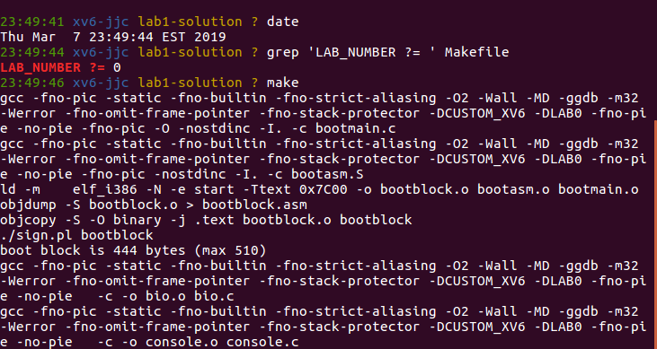

In the second screen show, the same information is displayed. This is used to show that the two screen shots are from the same compilation sequence. The expected outcome is that the compilation step will correctly compile with the lab flag set to **0**.

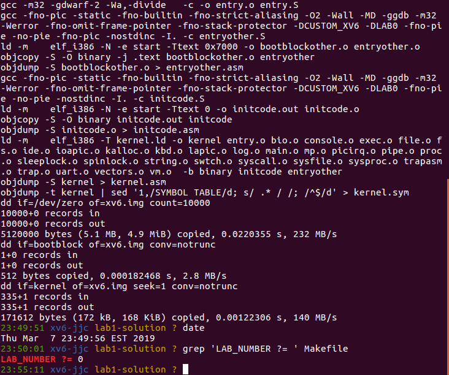

The date in the first and second figures show about ~12 seconds of elapsed time. This shows that the two date commands occurred close in time. The `grep` commands before and after the compilation show that the lab flag in the `Makefile` is set to **0**. The `date` commands are executed close in time, the lab flag shows the same value before and after the compilation, and the compilation shows no errors. This leads to the conclusion that the lab code correctly compiles with the lab flag turned off.

This subtest **PASSES**.

### Subtest 2

Boot compile with `LAB_NUMBER` set to **1** in `Makefile`. Since the listing is so long, this will require two screen shots.

In the first screen shot, the current date and time is displayed as well as the value for `LAB_NUMBER`, verifying that it is set to **1**.

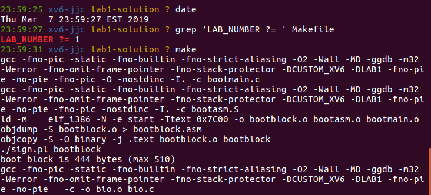

In the second screen show, the same information is displayed. This is used to show that the two screen shots are from the same compilation sequence. The expected outcome is that the compilation step will correctly compile with the lab flag set to **1**.

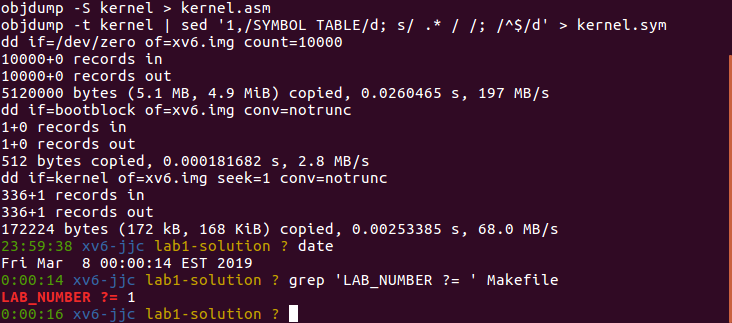

The date in the first and second figures show about ~45 seconds of elapsed time. This shows that the two date commands occurred close in time. The `grep` commands before and after the compilation show that the lab flag in the `Makefile` is set to **1**. The `date` commands are executed close in time, the lab flag shows the same value before and after the compilation, and the compilation shows no errors. This leads to the conclusion that the lab code correctly compiles with the lab flag turned on.

This subtest **PASSES**.

Since each subtest passes and the subtests fully test the objectives, this test **PASSES**.

## PRINT_SYSCALLS Test

This test verifies that the kernel correctly compiles with the flag `PRINT_SYSCALLS` turned off, set to **0** in the `Makefile`. This test has two subtests:

1. the kernel correctly compiles and boots with the `LAB_NUMBER` — flag turned off; and
2. the kernel correctly compiles and boots with the `LAB_NUMBER` — flag turned on.

Since the `PRINT_SYSCALLS` causes all system calls to be printed along with their return
codes, booting to the shell is sufficient as that process causes many system calls to be invoked. It is expected that no system call information will be printed to the console.

**Subtest 1:** `PRINT_SYSCALLS` and `LAB_NUMBER` set to 0. Following command shows that both parameters set to **0**.

    grep -E '^(LAB_NUMBER|PRINT_SYSCALLS)\s?=*' Makefile

Next screen shots show that *xv6* was successfully booted:

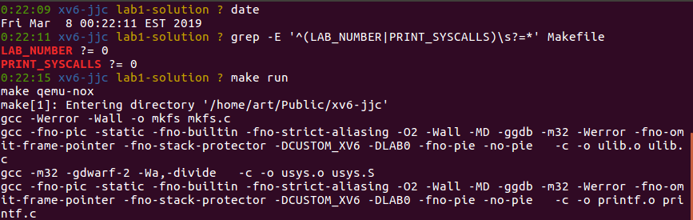

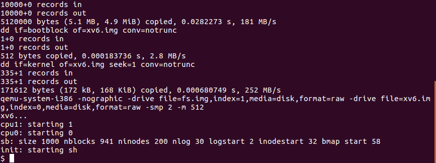

No system call information is displayed on boot with `PRINT_SYSCALLS` and `LAB_NUMBER`
set to 0, as expected. This subtest **PASSES**.

**Subtest 2:** `PRINT_SYSCALLS` set to 0 and `LAB_NUMBER` set to 1.

Next screen shots show that *xv6* was successfully booted:

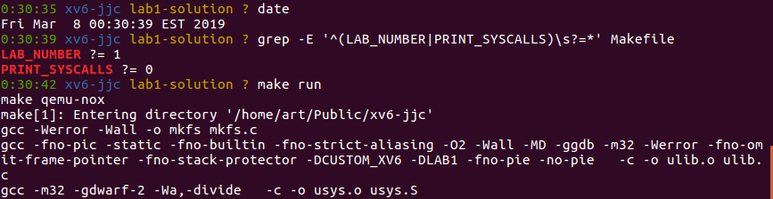

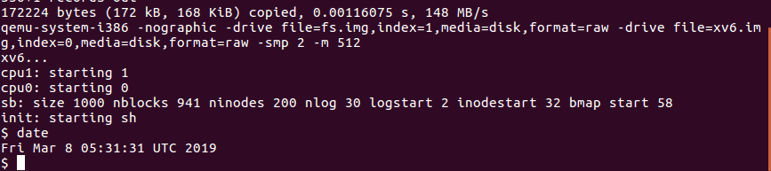

No system call information is displayed on boot with `PRINT_SYSCALLS` set to 0 and `LAB_NUMBER` set to 1, as expected. This subtest **PASSES**.

Both subtests pass. This test therefore **PASSES**.

### System Call Tracing Facility

This test verifies that the kernel correctly compiles with the flag `PRINT_SYSCALLS` turned on, set to **1** in the `Makefile`. This test boots the kernel to the shell prompt. The output should contain additional information from the **`PRINT_SYSCALLS` turned off test**; specifically a list of system calls and their return codes should be displayed. This list should closely match the output shown in the lab description.

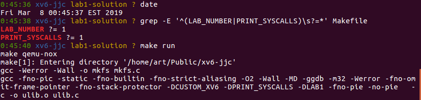

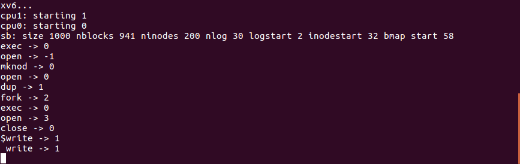

The system call trace correctly displays the invoked system calls and matches the reference output from the lab description. Standard output is interleaved with the trace output, as expected.

This test **PASSES**.

## usertests and forktest

I tested that *xv6* correctly compiles and runs with the `LAB_NUMBER` flag set to **0** in the `Makefile`.

It is expected that *xv6* will boot normally and both `usertests` and `forktest` programs will successfully execute. Since `forktest` is executed as part of `usertests`, only `usertests` will be executed.

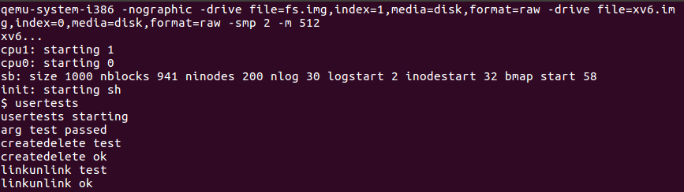

Some output has been omitted.

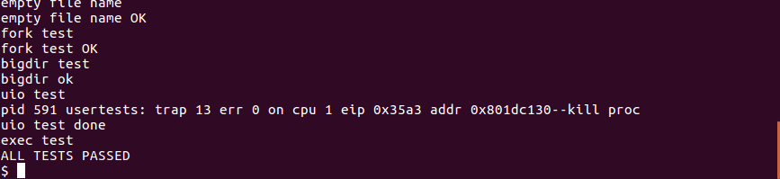

From both figures, we can see that all `usertests` have passed. Further, since `forktest` is run as a part of `usertests`, we know that `forktest` has passed.

This test **PASSES**.

I tested that *xv6* correctly compiles and runs with the `LAB_NUMBER` flag set to **1** in the `Makefile`, compiled and booted *xv6* using `make run`, and then ran `usertests`.

As mentioned above, this is an acceptable test for both `usertests` and `forktest` since `forktest` is run as part of `usertests`.
It is expected that all tests from `usertests` will pass.

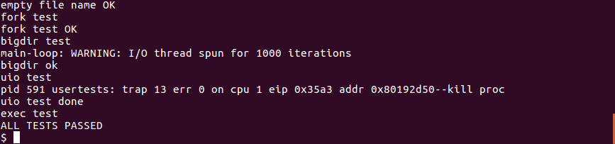

From the above figure, we can see that all `usertest` tests pass.

This test **PASSES**.

## `date` Command

This test verifies that `date` command works correctly. The expected output is a close match to running the Linux date command `date -u`.

The test will require:

1. boot *xv6*
2. run the `date` command under *xv6*
3. exit `xv6` (I will use the control sequence)
4. run `date -u` at the Linux prompt

Note that the Linux output is expected to display a few seconds later than the *xv6* `date` command as it takes non-zero time to perform the *xv6* shutdown and Linux
command invocation.

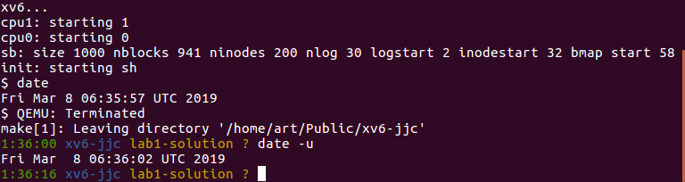

As expected, the *xv6* `date` command prints the same information in the same format as the Linux `date` command and the seconds field is a few seconds later for the Linux command than the *xv6* command.

This test **PASSES**.

## Control-P Format

In this test, we verified that `Control-P` displays processes with the correct header, that process information is aligned with the appropriate header, and that the correct data is displayed.

It is expected that I will observe a well-formatted and correct output from the `Control-P` command.

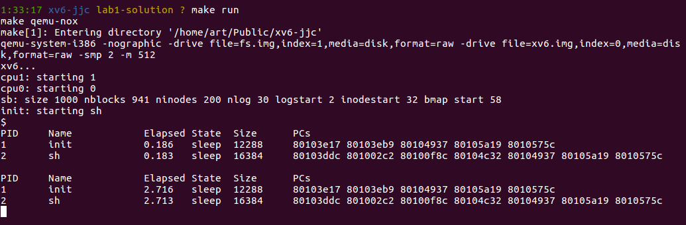

From the above figure, we can see that the header contains the appropriate fields, that the appropriate process information is aligned with each header item, and that the process information
displayed is correct (it is assumed that the program counters are correct).
The elapsed time for the `init` process is slightly higher than for the `sh` process. This is expected since the `init` process is the first process to start and `init` is responsible for starting `sh`. In addition, the elapsed time increases with ever press of `Control-P`. This is the expected and desired behavior.

This test **PASSES**.
